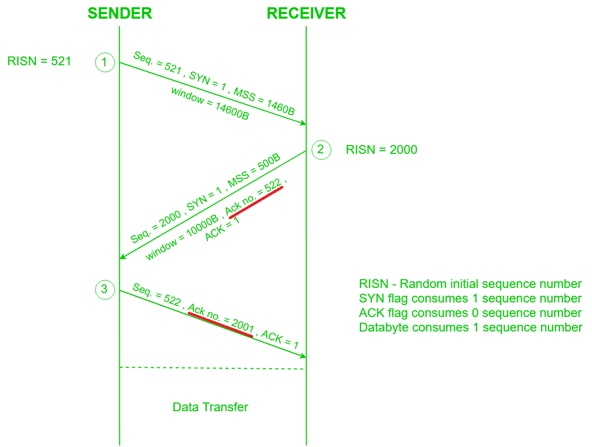

# ch.17 TCP overview
  
 

# ch.18 TCP Connection Establishment and  Termination

- Three-way handshaking
    + 重點是 Ack number 都是對方 seq + 1
  

- terminate by FIN
    + FIN -> ACK -> FIN -> ACK
  
- MSS
- half-close
- TCP state transiton 
- 2MSL Wait State
    + 避免最後的 FIN 遺失
- quiet time
  
 

# ch.19 TCP Interactive Data Flow
- Tinygrams
- delayed acknowledges
    + piggyback
- Nagle algorithm
  + outstanding data
  + self-clocking
  
 

# ch.20 TCP Bulk Data Flow
- Fast Sender, Slow Receiver => win 0
- push flag
- Sliding Windows
- Slow Start
    + cwnd &nbsp;(sender's flow control)
    + win &nbsp;&nbsp;&nbsp; (receiver’s flow control)
    + algorithm
    + exponential increase
- bandwidth-delay product
- urgent mode
    + out-of-band

 

# ch.21 TCP Timeout and Retransmission
- RTO 
    + how to calculate RTO ?
    + RTT
    + Karn’s Algorithm
        * retransmission ambiguity problem
- Congestion
    + Jacobson‘s fast retransmit algorithm
- Congestion Avoidence
    + 2 indications of packet loss
    + algorithm 
        * cwnd
        * ssthresh
- Fast Retransmit
- Fast Recovery 
- Repacketization

 

# ch.22 TCP Persist Timer
- persist timer
    + when use ?
    + window probes 
- Silly Window Syndrome

 

# ch.23 TCP Keepalive Timer
- keepalive timer
- 4 different scenarios

 

# ch.24 TCP Futures and Performance
- Long fat pipes 
    + Packets loss in an LFN can reduce throughput drastically. (why?)
- Big Packets or Small Packets?
    + give an example
- PAWS
- TCP Performance 
    + BW = Window/RTT 
- TCP受到1G和光速限制

